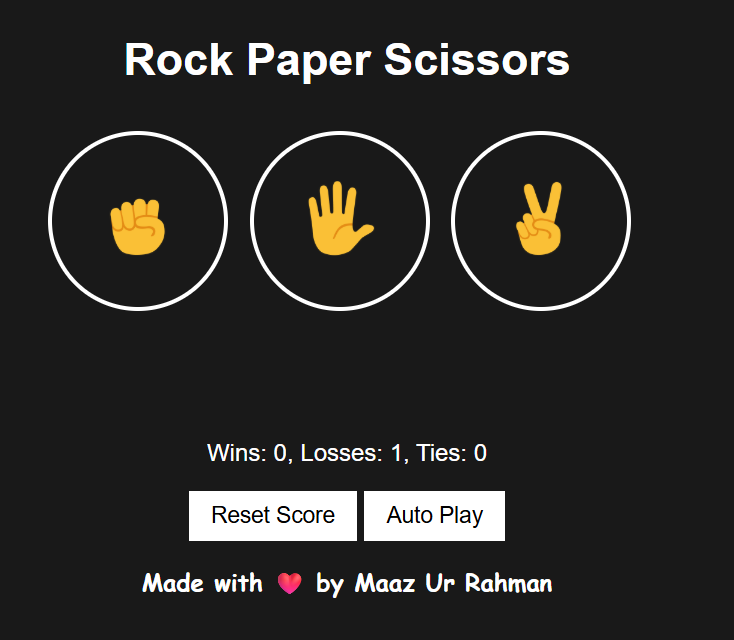
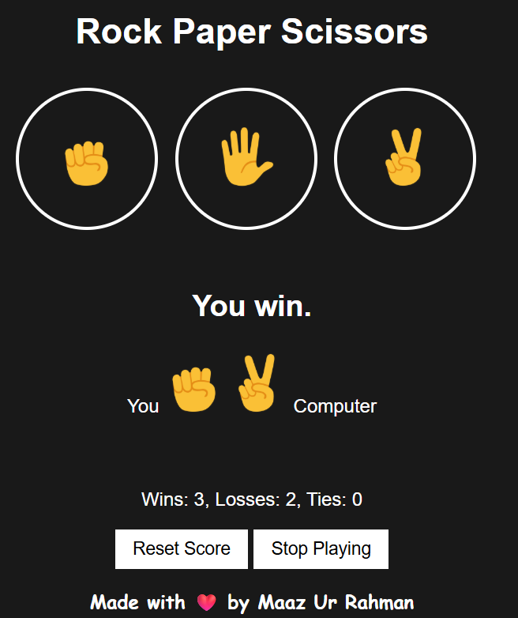
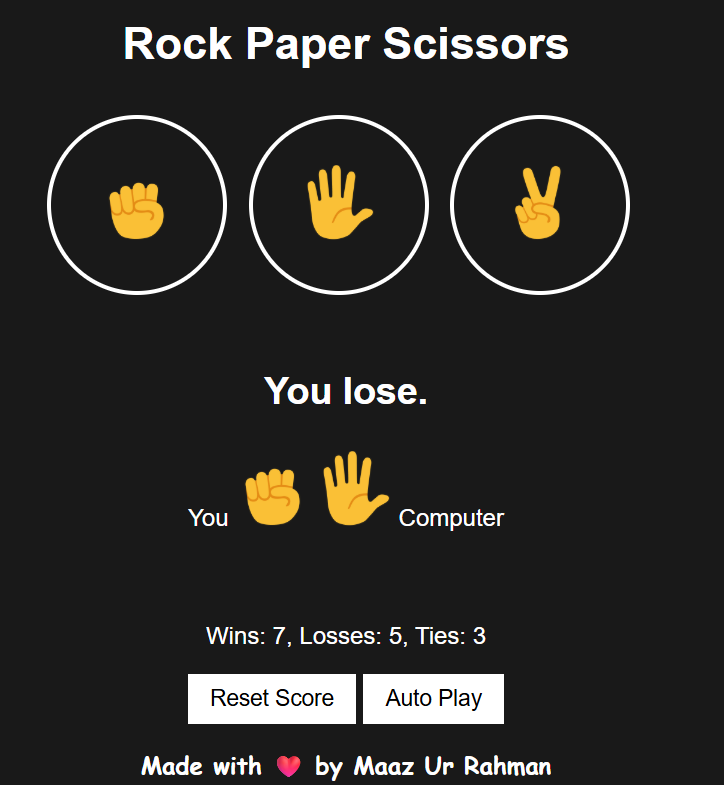
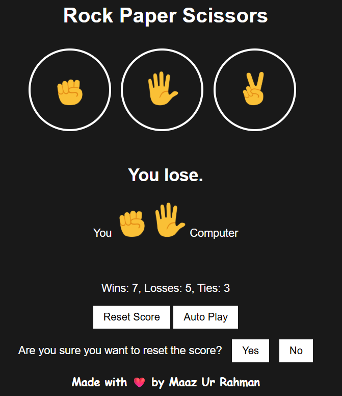

# Rock Paper Scissor Game 🪨📄✂️

A simple and interactive Rock Paper Scissors game built using HTML, CSS, and JavaScript. Play manually or enable auto-play to see the computer battle itself!

## 🌟 Features

- Intuitive and colorful UI.
- Rock, Paper, and Scissor emoji-based buttons.
- Score tracking for wins, losses, and ties.
- Reset score functionality.
- Auto-play mode where the computer plays automatically.

## 📁 Project Structure

```
rock-paper-scissor-game/
├── rock-paper-scissor-game.html         # Main HTML file
├── Style/
│   └── rock-scissor-paper.css           # Styles for layout and visuals
├── Script/
│   └── rock-paper-scissor-game.js       # Game logic and interactivity
└── Images/
    ├── title.png                        # Favicon image
    ├── rock-emoji.png                   # Rock emoji icon
    ├── paper-emoji.png                  # Paper emoji icon
    ├── scissor-emoji.png                # Scissor emoji icon
    ├── 01.png                           # Screenshot 1
    ├── 02.png                           # Screenshot 2
    ├── 03.png                           # Screenshot 3
    └── 04.png                           # Screenshot 4
```

## 🚀 Getting Started

To run the project locally:

1. Clone the repository or download the files.
2. Make sure the folder structure is preserved (`Images/`, `Style/`, and `Script/` folders).
3. Open the `rock-paper-scissor-game.html` file in any web browser.
4. Click on Rock, Paper, or Scissor to start playing!

## 🛠 Technologies Used

- **HTML5** – for the structure of the page.
- **CSS3** – for styling and layout.
- **JavaScript (Vanilla)** – for all game logic and interactivity.

## 🎮 Keyboard Controls

You can also play using your keyboard:

- Press **R** for Rock
- Press **P** for Paper
- Press **S** for Scissors
- Press **A** to toggle Auto Play
- Press **Backspace** to reset the score

## 🧠 How It Works

- The user selects one of the three moves by clicking on an icon.
- The computer randomly picks one of the three moves.
- The result is shown instantly.
- The score updates dynamically.
- Clicking “Reset Score” clears all scores.
- Clicking “Auto Play” makes the game run on its own.

## 📸 Screenshots

Here's how the game looks in action:






## 🙌 Author

Made with ❤️ by **Maaz Ur Rahman**  
Feel free to contribute or suggest improvements!

---

Enjoy playing and coding! 🎮👨‍💻
